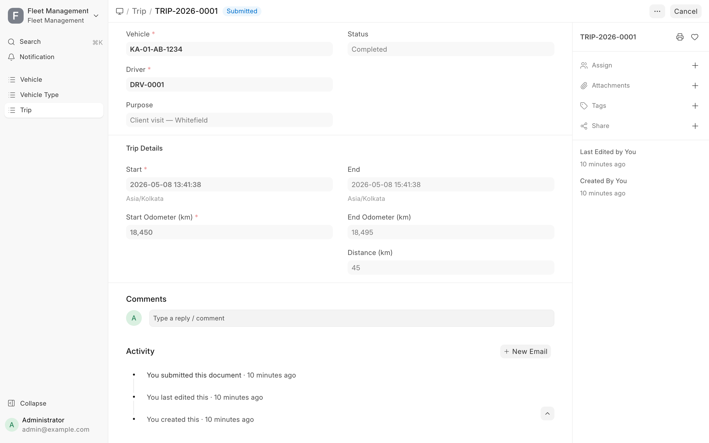
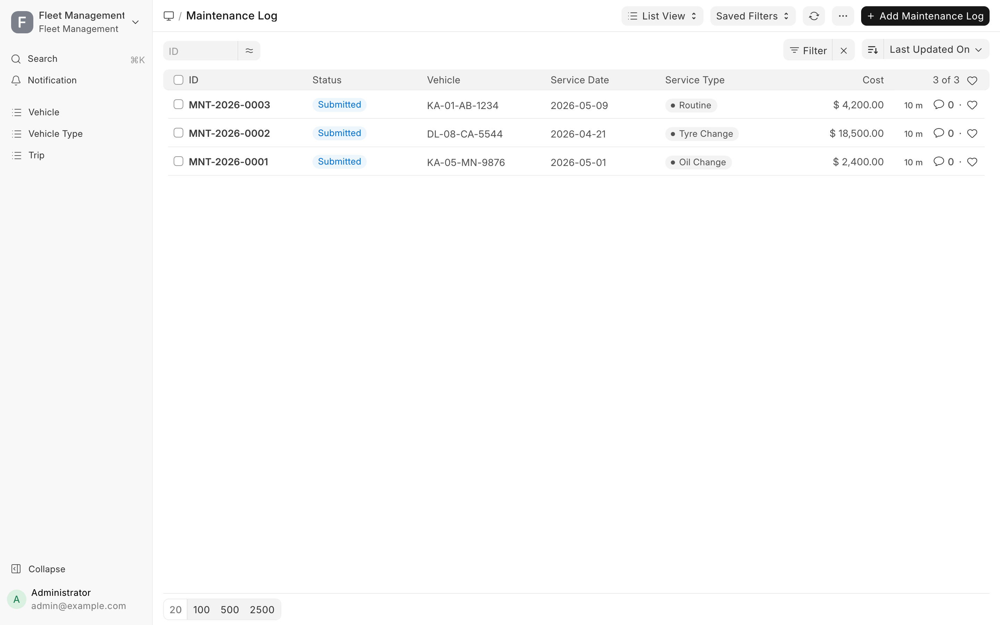
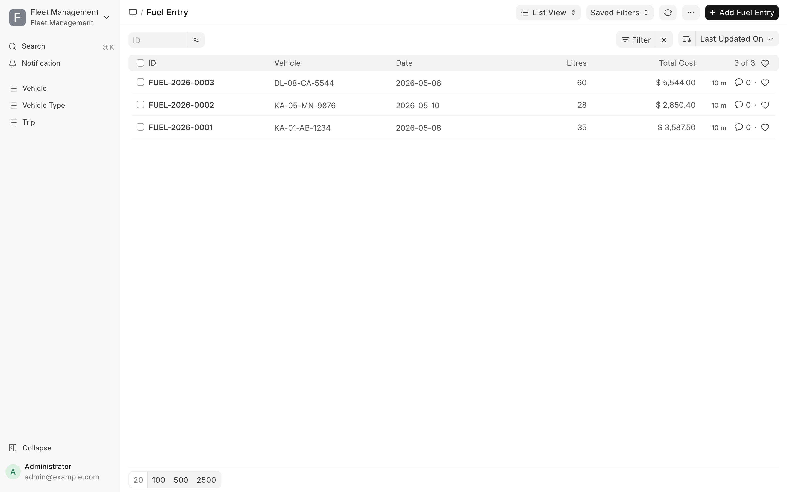
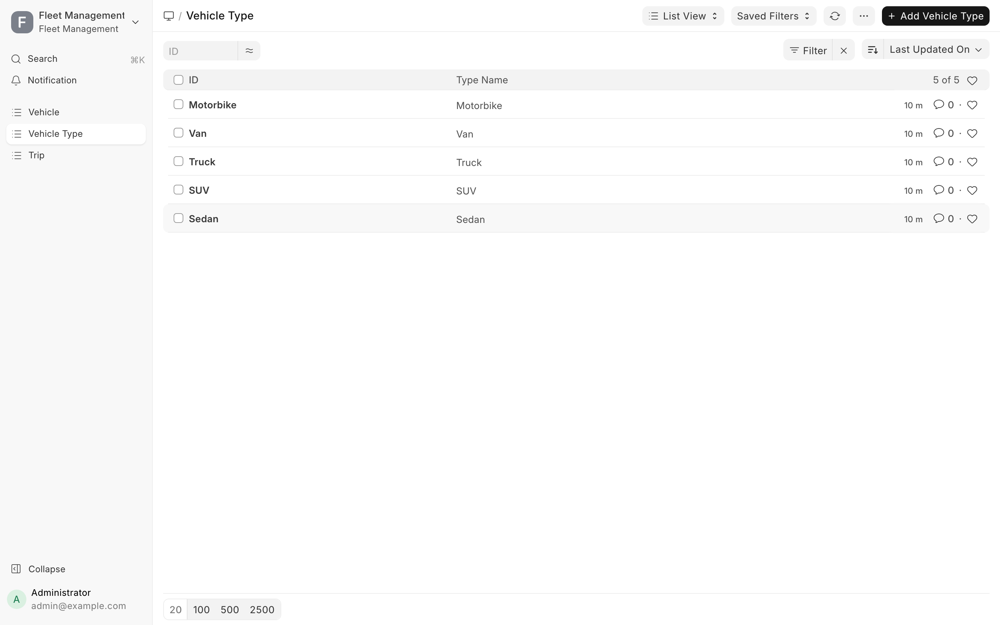

# Fleet Management

A compact Frappe app for managing a fleet of vehicles, drivers, trips, maintenance, and fuel. Built as a Frappe v16 application demonstrating DocTypes with submittable documents, hooks-driven business logic, whitelisted REST/API methods, role-based permissions, and dependent client scripts.


## Features

- **Vehicles** — registration, make/model/year, type, status (Active / In-Use / Maintenance / Retired), live odometer
- **Drivers** — license tracking with auto-warning when expiry is within 30 days
- **Trips** (submittable) — start/end odometer with computed distance, status workflow, side-effects on vehicle odometer and status on submit / cancel
- **Maintenance Log** (submittable) — flips vehicle to Maintenance on `Breakdown` service type
- **Fuel Entry** — auto-computed total cost, odometer roll-forward
- **REST API** — three whitelisted methods for vehicle summary, license expiries, and a fleet dashboard
- **Roles** — `Fleet Manager`, `Mechanic`, `Driver Role` (created during `after_install`)
- **Scheduled job** — daily license-expiry check writes warnings to the `fleet` logger

## Architecture

```
+---------------------+      +---------------------+
| Driver              | <----| Vehicle             |
| - license_no        |      | - registration_no   |
| - license_expiry    |      | - status            |
| - status            |      | - odometer_km       |
+----------+----------+      | - current_driver --+
           |                 +--------+------------+
           |                          |
           |  +-----------+           |
           +->| Trip      |<----------+
           |  | (submit)  |
           |  | start_odo |
           |  | end_odo   |
           |  | distance  |
           |  +-----------+
           |
           |  +-------------------+
           +->| Fuel Entry        |
           |  | litres, cpl       |
           |  | total (computed)  |
           |  +-------------------+
           |
              +-------------------+
              | Maintenance Log   |<-- Vehicle
              | (submit, flips    |
              |  status to        |
              |  Maintenance      |
              |  on Breakdown)    |
              +-------------------+

Vehicle Type (master) <-- Vehicle.vehicle_type
```

## Installation

```bash
cd $PATH_TO_YOUR_BENCH
bench get-app https://github.com/abhijitnairDhwani/fleet-management-frappe --branch main
bench new-site fleet.localhost --db-type sqlite --admin-password admin --install-app fleet_management
bench --site fleet.localhost execute fleet_management.demo_seed.seed    # optional sample data
bench --site fleet.localhost serve --port 8001
```

Then open `http://127.0.0.1:8001/login` and sign in with `Administrator / admin`.

The `after_install` hook creates the three custom roles and seeds the master Vehicle Types (Sedan, SUV, Truck, Van, Motorbike). The optional `demo_seed.seed` populates 5 vehicles, 3 drivers, 5 trips (including a planned/open trip), 3 maintenance logs, and 3 fuel entries.

## REST API

All custom endpoints are exposed under `/api/method/fleet_management.api.<method>`. Authenticate using a Frappe API key + secret, an OAuth token, or session cookies via `/api/method/login`.

### `get_vehicle_summary(vehicle)`

Returns trip count, total km, last service, current driver, fuel totals.

```bash
curl -s 'http://127.0.0.1:8001/api/method/fleet_management.api.get_vehicle_summary?vehicle=KA-01-AB-1234' \
  -H 'Authorization: token <api_key>:<api_secret>'
```

```json
{
  "message": {
    "vehicle": "KA-01-AB-1234",
    "make": "Tata",
    "model": "Nexon",
    "status": "Active",
    "odometer_km": 18615.0,
    "current_driver": "DRV-0002",
    "trips": 2,
    "total_km": 165.0,
    "last_service": {"service_date": "2026-05-09", "service_type": "Routine"},
    "fuel_litres_total": 35.0,
    "fuel_cost_total": 3587.5
  }
}
```

### `upcoming_license_expiries(days=30)`

Drivers whose licenses expire within `days` ahead.

```bash
curl -s 'http://127.0.0.1:8001/api/method/fleet_management.api.upcoming_license_expiries?days=60' \
  -H 'Authorization: token <api_key>:<api_secret>'
```

```json
{
  "message": [
    {
      "name": "DRV-0001",
      "full_name": "Ramesh Kumar",
      "license_no": "DL-AP-2024-001",
      "license_expiry": "2026-05-25",
      "phone": "+91 98765 11111"
    }
  ]
}
```

### `fleet_dashboard()`

High-level operational KPIs.

```bash
curl -s 'http://127.0.0.1:8001/api/method/fleet_management.api.fleet_dashboard' \
  -H 'Authorization: token <api_key>:<api_secret>'
```

### Standard Frappe REST (auto-generated per DocType)

```bash
# list
curl 'http://127.0.0.1:8001/api/resource/Vehicle?limit_page_length=5'

# detail
curl 'http://127.0.0.1:8001/api/resource/Trip/TRIP-2026-0001'

# create
curl -X POST 'http://127.0.0.1:8001/api/resource/Driver' \
  -H 'Content-Type: application/json' \
  -H 'Authorization: token <api_key>:<api_secret>' \
  -d '{"full_name":"Anita Rao","license_no":"DL-KA-2025-001","license_expiry":"2027-12-01"}'
```

## Business logic

| DocType | Hook | Behavior |
|---|---|---|
| `Driver` | `validate` | Emits orange/red `msgprint` when license is ≤30 days from expiry or expired |
| `Vehicle` | `validate` | Rejects unrealistic year, negative odometer |
| `Trip` | `validate` | Computes `distance_km`; rejects end<start; rejects assignment to Maintenance/Retired vehicle or Inactive driver |
| `Trip` | `before_submit` | Requires end-time + end-odo; sets status `Completed` |
| `Trip` | `on_submit` | Updates Vehicle odometer (high-water-mark) and `current_driver`; flips `In-Use → Active` |
| `Trip` | `on_cancel` | Recomputes Vehicle odometer from remaining submitted trips |
| `Maintenance Log` | `on_submit` | `Breakdown` → Vehicle status `Maintenance`; non-breakdown service while in Maintenance → `Active`; rolls odometer forward |
| `Fuel Entry` | `validate` | Rejects non-positive litres / negative cost; recomputes `total_cost` |
| `Fuel Entry` | `on_update` | Rolls Vehicle odometer forward if entry odo is higher |

Daily scheduler: `fleet_management.scheduled.check_license_expiries` logs warnings for any active driver with a license expiring inside the window (default 30 days).

## Roles & permissions

| Role | DocType access |
|---|---|
| `Fleet Manager` | Full CRUD + submit/cancel/amend on Trip and Maintenance Log; CRUD on Vehicle / Driver / Vehicle Type / Fuel Entry (no delete) |
| `Mechanic` | Maintenance Log (CRU + submit); read/write Vehicle |
| `Driver Role` | Read on Driver and Vehicle; CRU on own Fuel Entry; read Trip |
| `System Manager` | Everything (default) |

## Screenshots

| Screen | Image |
|---|---|
| Home / Workspace |  |
| Vehicle list |  |
| Vehicle form |  |
| Driver list |  |
| Driver form (license warning) |  |
| Trip list |  |
| Trip — submitted |  |
| Maintenance Log list |  |
| Fuel Entry list |  |
| Vehicle Type master |  |

## Demo video

A short headless walkthrough is included at [`docs/video/fleet-management-demo.mp4`](docs/video/fleet-management-demo.mp4) (also `.webm`).

## Project layout

```
fleet_management/
├── fleet_management/
│   ├── hooks.py
│   ├── install.py             # after_install: create roles + seed Vehicle Types
│   ├── api.py                 # 3 whitelisted endpoints
│   ├── scheduled.py           # daily license-expiry check
│   ├── demo_seed.py           # populates sample data
│   ├── modules.txt
│   └── fleet_management/
│       └── doctype/
│           ├── vehicle/        (json, py)
│           ├── vehicle_type/   (json, py)
│           ├── driver/         (json, py, js)
│           ├── trip/           (json, py, js)
│           ├── maintenance_log/(json, py)
│           └── fuel_entry/     (json, py, js)
├── license.txt
├── pyproject.toml
└── README.md
```

## Development notes

- Frappe v16, Python 3.11–3.14, Node 18+
- DocType JSONs are checked in; run `bench --site <site> migrate` after pulling
- Site DB used during build was SQLite — supported by Frappe v16 but marked experimental. For production use MariaDB / Postgres
- Demo data is idempotent — re-running `demo_seed.seed` will not duplicate existing drivers / vehicles
