# Fleet Management

A compact, dashboarded Frappe v16 application for running a small vehicle fleet — vehicles, drivers, trips, maintenance, and fuel — with hooks-driven business logic, a workspace of KPI cards and charts, role-based permissions, REST API, unit tests, and CI.

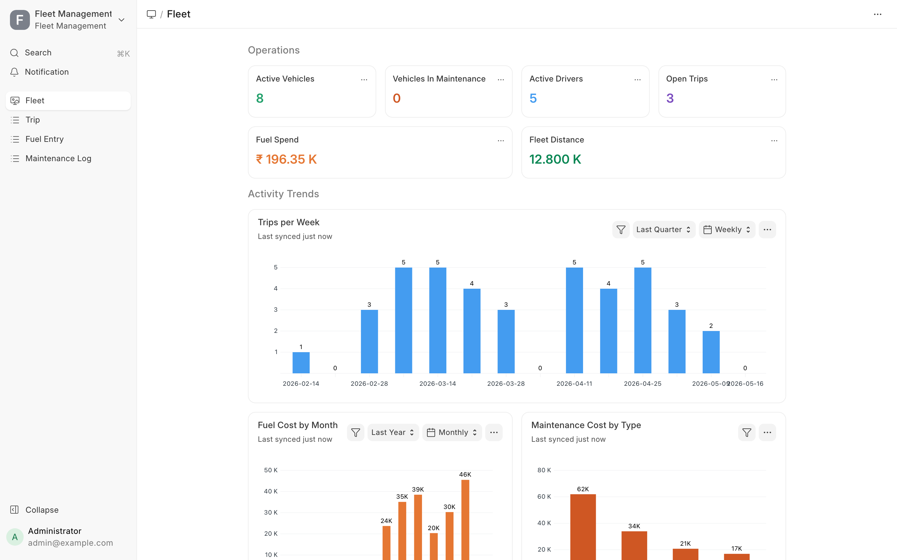

---

## What's inside

- **Fleet workspace** — 6 number cards (Active Vehicles, In Maintenance, Active Drivers, Open Trips, Fuel Spend, Fleet Distance) and 4 dashboard charts (Trips per Week, Fuel Cost by Month, Maintenance Cost by Type, Vehicle Status Mix)
- **Six DocTypes** with relationships, validations, and hook-driven side effects
- **Submittable workflow** on Trip and Maintenance Log
- **Three whitelisted REST endpoints** under `/api/method/fleet_management.api.*`
- **Three custom roles** created in `after_install`: `Fleet Manager`, `Mechanic`, `Driver Role`
- **Five client scripts** (auto-fill driver from vehicle, live distance recompute, live total-cost, license indicator pill, …)
- **Print format** — Jinja-templated *Trip Log* with KPI cards and signature blocks (A4)
- **Scheduler job** — daily license-expiry check
- **13 unit tests** for Trip lifecycle, Driver license logic, and Fuel Entry computations — all green

## Data model

```
Vehicle Type (master) ──┐
                        ▼
                   ┌─ Vehicle ─────┐
                   │  status, odo  │
       ┌───────────┤  current_drv ─┼────────────┐
       ▼           │               │            ▼
     Trip       Fuel Entry     Maintenance Log
   (submit)    (cost = l*cpl)   (submit, may
   distance =                    flip vehicle
   end − start                   to Maintenance)
   end_odo → vehicle
   odometer roll-fwd

 Driver ◀─────── current_driver, trip.driver, fuel_entry.driver
   license_expiry warns @ 30d
```

## Install

```bash
cd $PATH_TO_YOUR_BENCH
bench get-app https://github.com/abhijitnairDhwani/fleet-management-frappe --branch main
bench new-site fleet.localhost --db-type sqlite --admin-password admin --install-app fleet_management
bench --site fleet.localhost execute fleet_management.demo_seed.seed   # ~70 trips, 50 fuel entries, 22 maintenance logs over 180 days
bench --site fleet.localhost serve --port 8001
```

Open `http://127.0.0.1:8001/login` → sign in as `Administrator / admin` → workspace at **Fleet**.

SQLite is used in the bench demo because it's experimental-but-supported in Frappe v16 and avoids the MariaDB-root-password ask. For production, use MariaDB / Postgres.

## REST API

All endpoints are under `/api/method/fleet_management.api.<method>` and require auth (Frappe API key+secret, OAuth, or session cookie).

### `get_vehicle_summary(vehicle)`

```bash
curl 'http://127.0.0.1:8001/api/method/fleet_management.api.get_vehicle_summary?vehicle=KA-01-AB-1234' \
  -H 'Authorization: token <api_key>:<api_secret>'
```

```json
{
  "message": {
    "vehicle": "KA-01-AB-1234",
    "make": "Tata", "model": "Nexon", "status": "Active",
    "odometer_km": 18615.0, "current_driver": "DRV-0002",
    "trips": 9, "total_km": 1235.0,
    "last_service": {"service_date": "2026-04-22", "service_type": "Oil Change"},
    "fuel_litres_total": 285.0, "fuel_cost_total": 28912.0
  }
}
```

### `upcoming_license_expiries(days=30)`

```bash
curl 'http://127.0.0.1:8001/api/method/fleet_management.api.upcoming_license_expiries?days=60'
```

### `fleet_dashboard()`

```bash
curl 'http://127.0.0.1:8001/api/method/fleet_management.api.fleet_dashboard'
```

### Standard Frappe REST

```bash
# list 5 vehicles
curl 'http://127.0.0.1:8001/api/resource/Vehicle?limit_page_length=5'

# get a trip
curl 'http://127.0.0.1:8001/api/resource/Trip/TRIP-2026-0070'

# create a driver
curl -X POST 'http://127.0.0.1:8001/api/resource/Driver' \
  -H 'Content-Type: application/json' \
  -H 'Authorization: token <api_key>:<api_secret>' \
  -d '{"full_name":"Anita Rao","license_no":"DL-KA-2025-001","license_expiry":"2027-12-01"}'
```

## Business logic

| DocType | Hook | Behavior |
|---|---|---|
| Driver | `validate` | Orange msgprint when license ≤30d from expiry; red when already expired |
| Vehicle | `validate` | Rejects unrealistic year or negative odometer |
| Trip | `validate` | Computes `distance_km`; rejects `end_odo < start_odo`, Maintenance/Retired vehicle, Inactive driver |
| Trip | `before_submit` | Requires end time + end odo; sets status Completed |
| Trip | `on_submit` | Rolls vehicle odometer forward (high-water-mark); sets `current_driver`; flips `In-Use → Active` |
| Trip | `on_cancel` | Rolls vehicle odometer back to the highest end_odo of any remaining submitted trip |
| Maintenance Log | `on_submit` | `Breakdown` → Vehicle status `Maintenance`; other types while in Maintenance → back to `Active`; rolls odometer forward |
| Fuel Entry | `validate` | Rejects non-positive litres / negative cost; recomputes `total_cost` |
| Fuel Entry | `on_update` | Rolls vehicle odometer forward if entry odo is higher |

## Roles & permissions

| Role | Access |
|---|---|
| `Fleet Manager` | Full CRUD + submit/cancel/amend on Trip and Maintenance Log; CRUD on Vehicle / Driver / Vehicle Type / Fuel Entry (no delete) |
| `Mechanic` | Maintenance Log (CRU + submit); read/write Vehicle |
| `Driver Role` | Read on Driver and Vehicle; CRU on own Fuel Entry; read Trip |
| `System Manager` | Everything (default) |

## Testing

```bash
bench --site fleet.localhost set-config allow_tests true
bench --site fleet.localhost run-tests --app fleet_management
```

```
Ran 13 tests in 0.285s

OK
```

Covers Trip distance computation, validation rejections, submit/cancel odometer side-effects, Driver license-warning paths, and Fuel Entry cost arithmetic.

## Screenshots

| Screen | Image |
|---|---|
| **Fleet workspace** (KPI cards + charts) |  |
| Vehicle list | 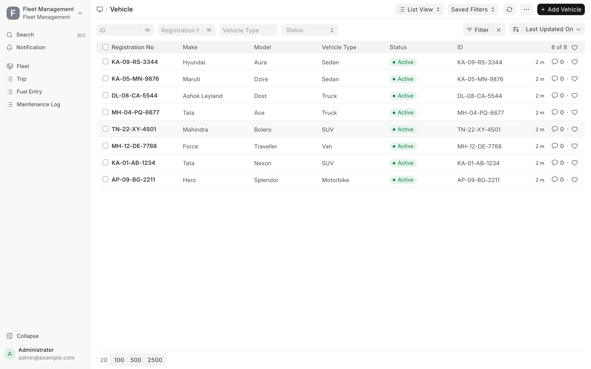 |
| Vehicle form | 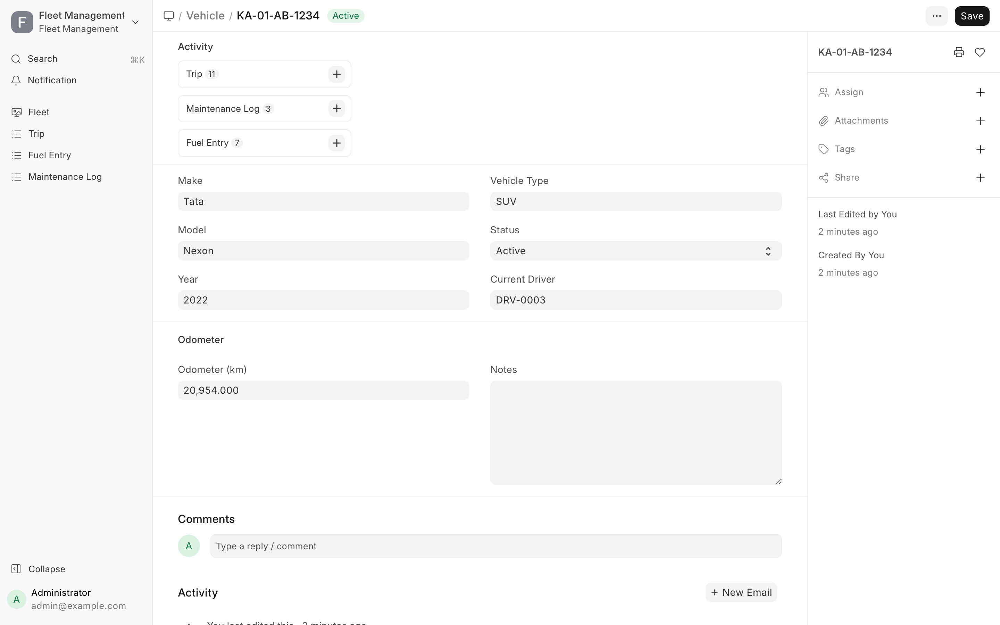 |
| Driver list | 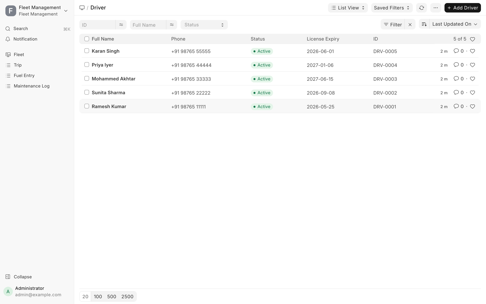 |
| Driver form (license-expiring orange pill) | 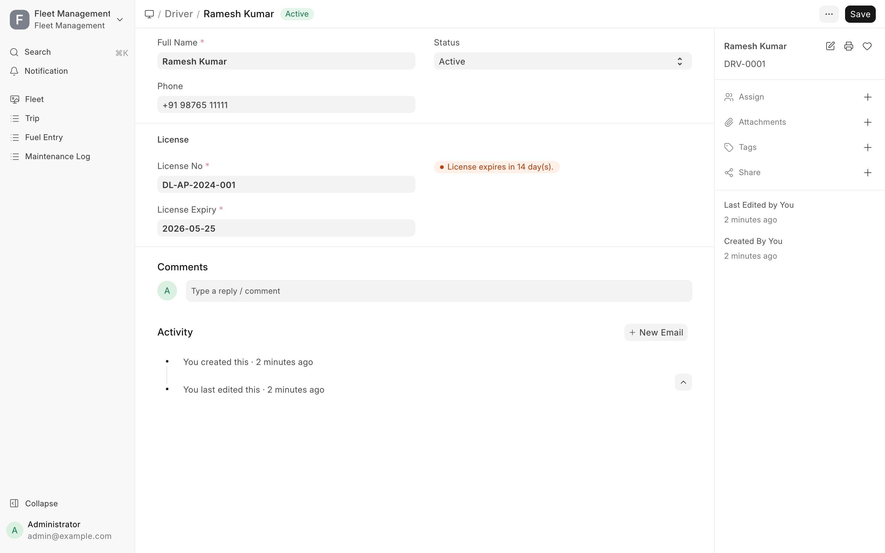 |
| Trip list | 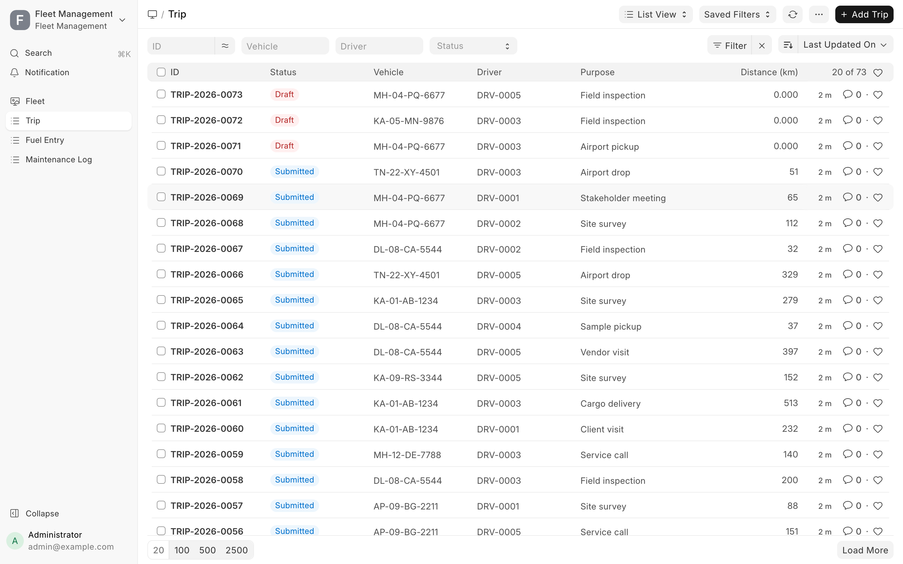 |
| Trip — submitted | 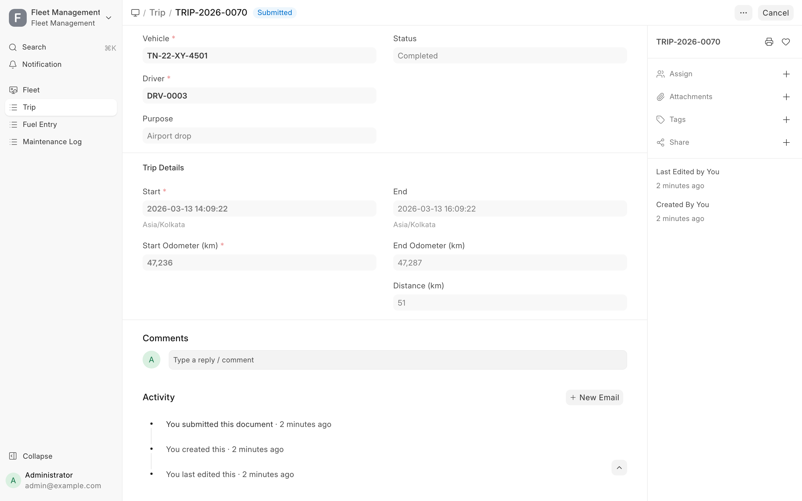 |
| Maintenance Log list | 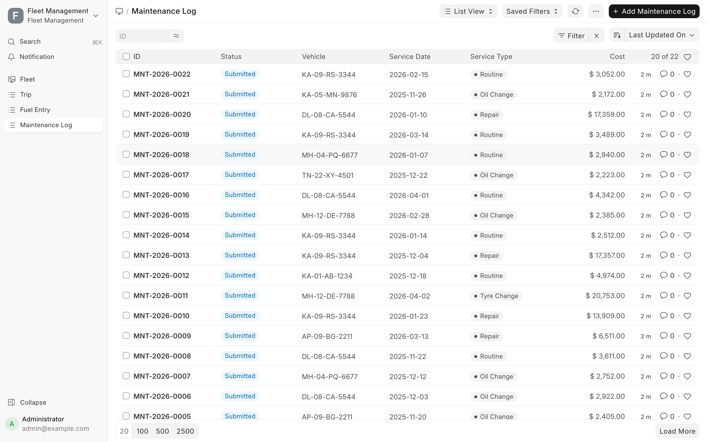 |
| Fuel Entry list | 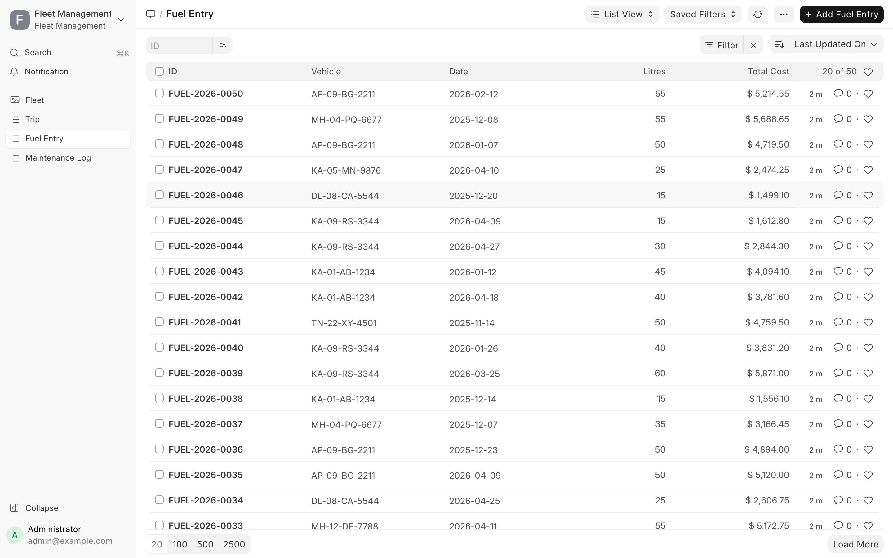 |
| Vehicle Type master | 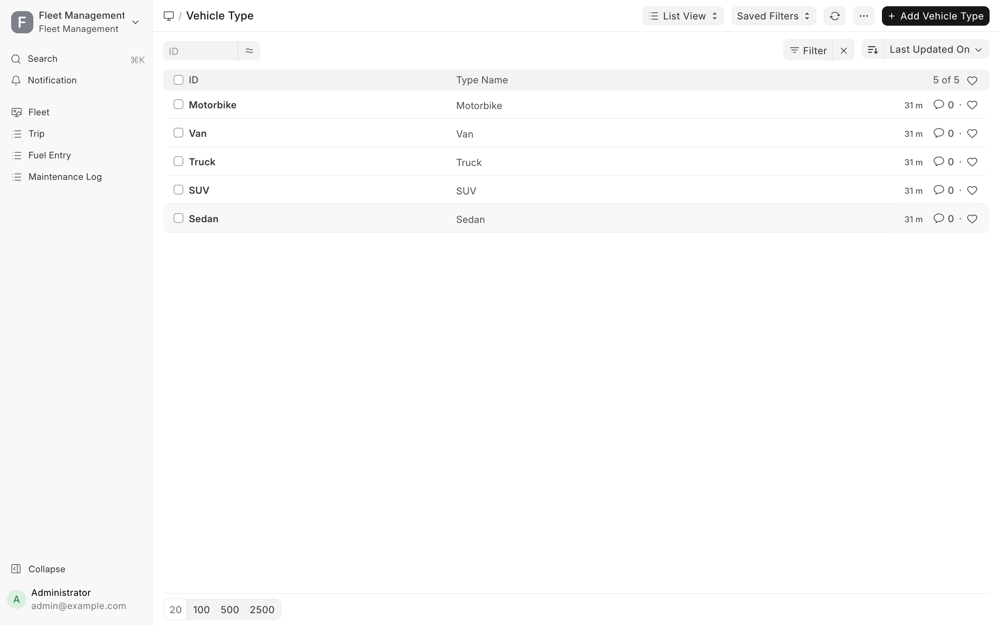 |
| New Trip form (live distance compute) | 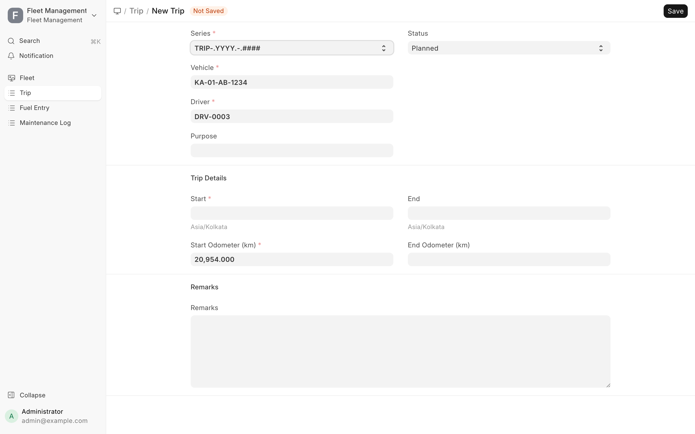 |

## Demo video

84-second headless walkthrough at [`docs/video/fleet-management-demo.mp4`](docs/video/fleet-management-demo.mp4) (also `.webm`). Covers: workspace + charts, vehicle list and form, driver near-expiry indicator, trip lifecycle, new-trip form with live distance compute, maintenance and fuel lists.

## Print format

`Trip Log` — a Jinja A4 print format for the Trip DocType with:
- KPI cards (distance, odometer delta, duration)
- Vehicle / driver / start / end / purpose / remarks
- Driver and Fleet Manager signature blocks

Reachable from the Trip form via *Menu → Print → Trip Log*.

## Project layout

```
fleet_management/
├── pyproject.toml                      # ruff + flit
├── license.txt                         # MIT — Abhijit Nair
├── README.md
├── docs/
│   ├── screenshots/                    # 11 PNGs
│   └── video/                          # mp4 + webm
└── fleet_management/
    ├── hooks.py                        # after_install, fixtures, scheduler
    ├── install.py                      # creates roles + seed Vehicle Types
    ├── api.py                          # 3 whitelisted endpoints
    ├── scheduled.py                    # daily license check
    ├── demo_seed.py                    # seed + reset_demo
    └── fleet_management/
        ├── doctype/
        │   ├── vehicle/        (json, py)
        │   ├── vehicle_type/   (json, py)
        │   ├── driver/         (json, py, js, test_driver.py)
        │   ├── trip/           (json, py, js, test_trip.py)
        │   ├── maintenance_log/(json, py)
        │   └── fuel_entry/     (json, py, js, test_fuel_entry.py)
        ├── number_card/                # 6 cards
        ├── dashboard_chart/             # 4 charts
        ├── workspace/fleet/             # Fleet workspace
        └── print_format/trip_log/       # Trip Log A4 print format
```

## Development

- Frappe v16, Python 3.10+, Node 18+
- DocType JSONs are checked in; run `bench --site <site> migrate` after pulling
- The seed is deterministic (`random.Random(42)`) — same dataset every run, idempotent
- For UI development, use `bench --site fleet.localhost serve --port 8001` so the production-relevant default site stays untouched
